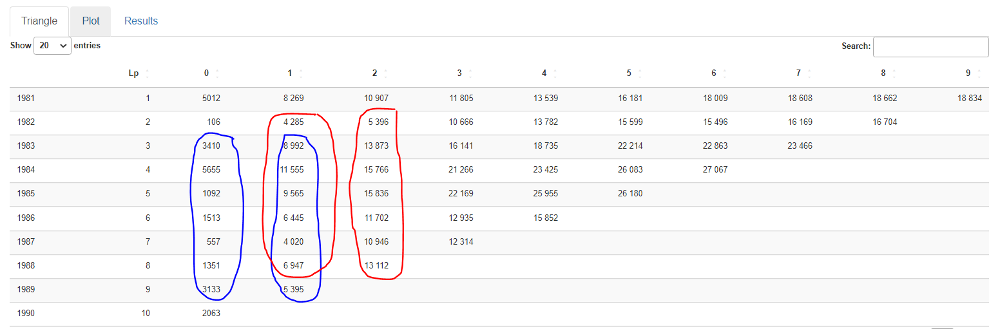
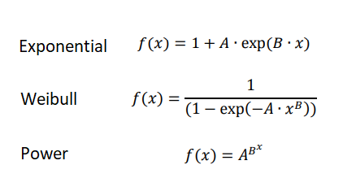
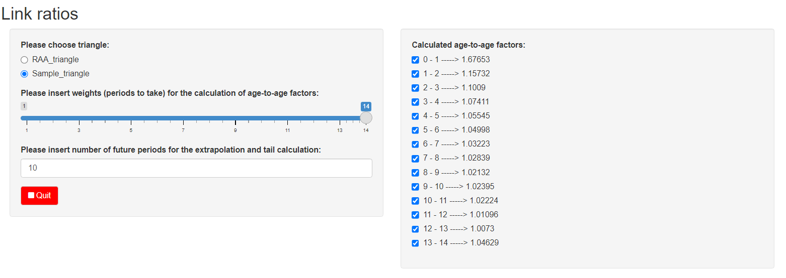
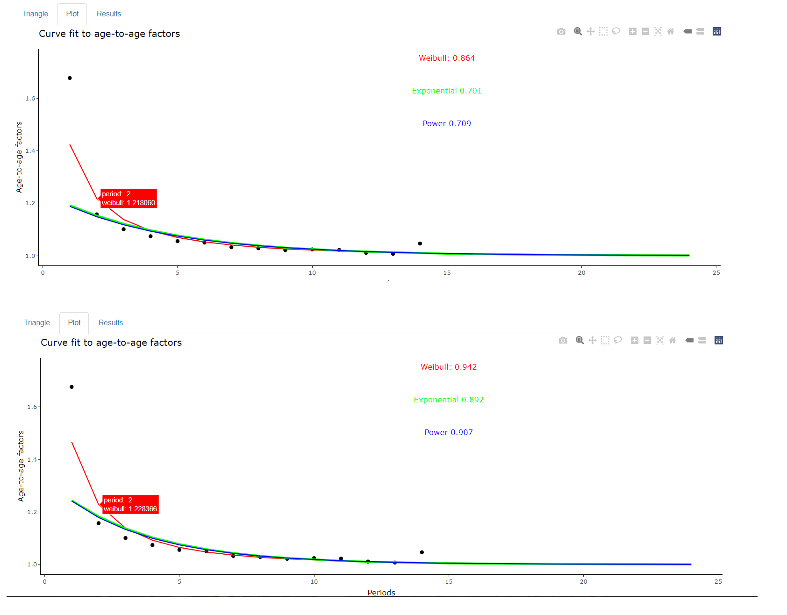
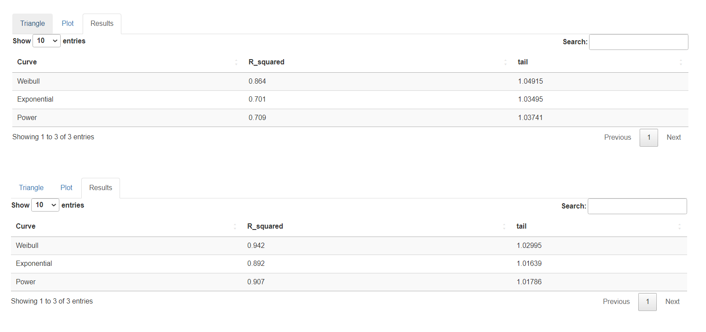

# Curve fit and tail calculation

The purpose of this mini project was to create a shiny app, that calculates age-to-age factors based on cumulative triangles, fits three curves to them with visualization and returns tails, having fully reactive output. 

## Input and libraries

The program gives a choice between two example cumulative triangles:
- RAA_triangle, taken from ChainLadder package,
- Sample_triangle, loaded from *data_file.txt* file.

The Sample_triangle data is based on gross claims paid in LoB 8 (Third party liability insurance) in Poland between 2003 and 2017 [Source](https://www.knf.gov.pl/?articleId=65250&p_id=18). The values are displayed in thousands PLN.

The following libraries are necessary:
```
library(ChainLadder) # only for initializing RAA and Sample triangles
library(ggplot2)
library(dplyr)
library(plotly)
library(shiny)
library(DT)
```

## Code

Firstly, a customized function (ata_weight), that calculates age-to-age factors, is introduced. The user can choose to use all or less periods from the triangle, that's why ata function from ChainLadder package was not an option. The idea behind weights is that the oldest periods might not fit to current business and conditions. Additionally, for technical purposes, missing, infinite or NaN factors are replaced by 1.

In the example below, weight equal to 7 means that 7 latest periods will be taken into account. So in the calculation of factor 0-1, first two rows of the triangle will be excluded (blue), in factor 1-2 only first row (red) and none for the rest:



Link_plot function performs curve fitting and returns two items:
- plot with age-to-age factors and fitted curves,
- table with tail and R squared per curve.

It has three arguments:
- vect, which is a final choice of factors for curve fitting - the user has an ability to exclude certain factors (e.g. outliers) in the interface,
- vect_ini, holding output of ata_weight function (full factors),
- mperiod, which denotes number of future periods for the extrapolation and tail calculation.

All the arguments are reactive and output is refreshed upon change.

In the program, three different curves are used, that are most common for such calculations:



To fit the models, the following transformations were necessary:
```
exp_mod<-lm(log(z-1)~y) # Exponential
wib_mod<-lm(log(-log(-(z^(-1)-1)))~log(y)) # Weibull
pwr_mod<-lm(log(log(z))~y) # Power
```
In case there are factors <= 1 (which could happen if e.g. claim had been shown incorrectly for some time under LoB 8), they are excluded from vect, as the fitting would fail.

Finally, at the end of *curve-fit.R* program, runApp function is executed with current directory (as argument), in which *ui.R* and *server.R* files are stored.


## Interface

The top panels display parameters the user can choose from, first one being the triangle.



Changing weights affects age-to-age factors shown on the right side panel. Each factor can be then exluded from the curve fitting by clicking on check-box next to it. 
Last input is number of future periods, that influences the tail itself.

### Plot pane
The graph (as well as Results pane) is refreshed every time triangle, weights, future periods or age-to-age factors change, which makes the analysis easy and user friendly (in real life cases it is time consuming to find the right combination of tail and R squared, as data isn't perfect and results have to be reasonable, also to the auditor).
In the example below, first plot corresponds to Sample_triangle with initial parameters, while second exludes the last factor (outlier), which significantly increased the R squared.



Initial factors from ata_weight function are always displayed, so the user can see their coordinates against the curves. The range of the graph is the sum of future periods and periods from vect_ini.
Additionally, the tooltip provides the exact factors (initial and per curve), while R squared is presented directly on the graph.

### Results pane
The table summarises results per curve. Next to R squared, tail is provided, being the cumulative product of future periods. Normally, the tail of best fitted curve is the optimal choice.
Example below (similarly to plot), shows tail values for Sample_triangle with initial parameters (first table) and excluding the last factor (second table).



The results of the analysis (especially tail), could be later used e.g. in the calculation of IBNR reserve. The program can be easily adjusted to take any triangle (for instance from external source) as an input.
